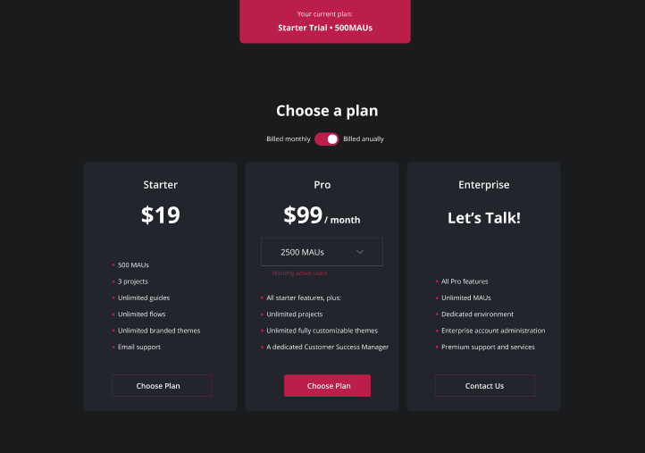

<h1 align="center"> Price Card Page </h1>

Este projeto visa desenvolver uma página de preços interativa e responsiva que permite aos usuários visualizar e comparar diferentes planos de forma clara e atrativa. A página foi criada com foco na experiência do usuário, utilizando um design moderno e intuitivo.  

  <a href="#-tecnologias">Tecnologias</a>&nbsp;&nbsp;&nbsp;|&nbsp;&nbsp;&nbsp;
  <a href="#-projeto">Projeto</a>&nbsp;&nbsp;&nbsp;|&nbsp;&nbsp;&nbsp;
  <a href="#-layout">Layout</a>&nbsp;&nbsp;&nbsp;|&nbsp;&nbsp;&nbsp;
  <a href="#memo-licença">Licença</a>

  

 

  

## 🚀 Tecnologias

Esse projeto foi desenvolvido com as seguintes tecnologias:

- HTML e CSS
- JavaScript
- Git e Github
- Figma

## 💻 Projeto

A página de preços é uma página que se adapta a diferentes tamanhos de tela, apresentado cards de preços, onde cada plano é apresentado
em um cartão visualmente atraente, com informações sobre recursos e preços.

- [Acesse o projeto finalizado, online](https://maykbrito.github.io/devlinks)

## :memo: Licença

Esse projeto está sob a licença MIT.

Feito com ♥ by Rocketseat :wave: [Participe da nossa comunidade!](https://discord.gg/rocketseat)
